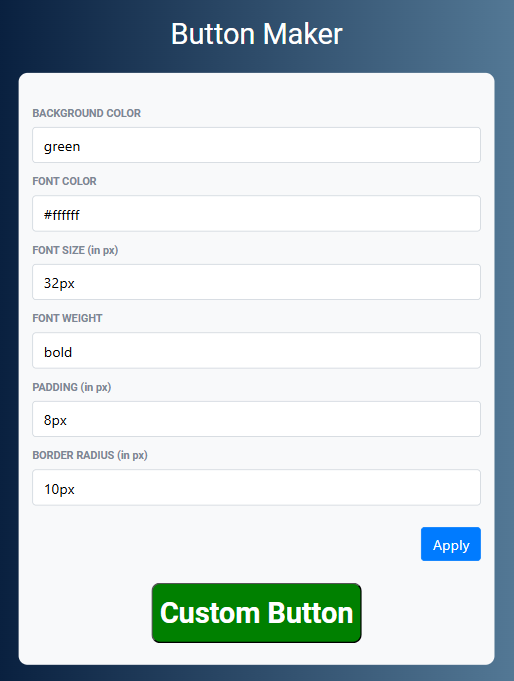

# Button Maker Project

This project allows users to dynamically create and customize a button with various properties such as background color, font color, font size, font weight, padding, and border radius. The customization is applied in real-time through user input fields and a "Apply" button.

### Button Customization Example


## Features

- Dynamically change button background color, font color, font size, font weight, padding, and border radius.
- Real-time application of styles.
- Responsive design using Bootstrap.

## Technologies Used

- HTML
- CSS
- JavaScript
- Bootstrap

## Getting Started

To get a local copy of the project up and running on your machine, follow these steps:

1. **Clone the repository:**

    ```sh
    git clone https://github.com/Ganeshmoorthii/Button-Maker.git
    ```

2. **Open the project directory:**

    ```sh
    cd Button-Maker
    ```

3. **Open `index.html` in your web browser to view the project.**

## Usage

1. Enter the desired values for the button properties (background color, font color, font size, font weight, padding, and border radius) in the input fields.
2. Click the "Apply" button to see the changes reflected in the button.


